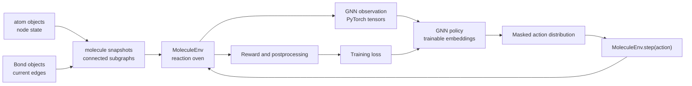
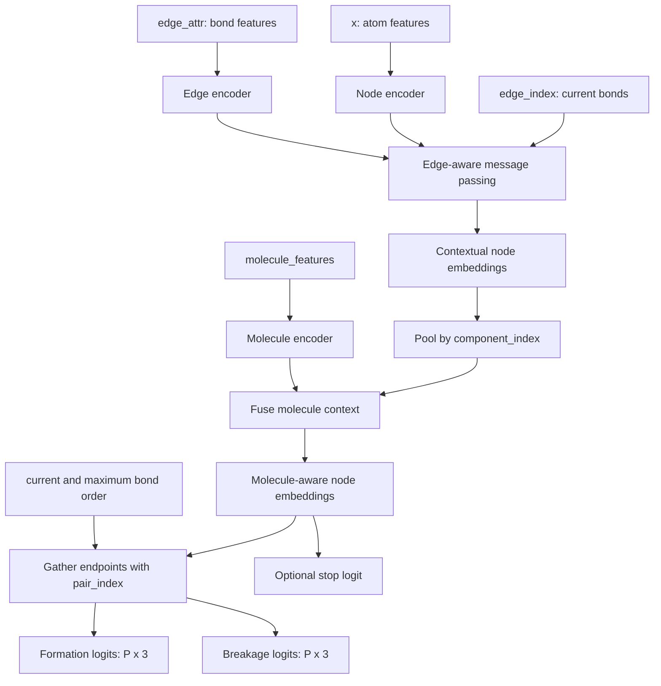

# Building a GNN training project with the four chemical graph objects

This guide explains how to use the four objects in `src/` as the chemical-state layer of a graph neural network training project:

- `atom` from `obj_node.py`
- `Bond` from `obj_edge.py`
- `molecule` from `obj_subgraph.py`
- `MoleculeEnv` from `obj_graph.py`

The central separation is:

> The four objects store and update the chemical graph. The neural network reads their features, creates trainable embeddings, and chooses graph-edit actions.

The Python objects themselves are not neural-network parameters. Their numerical features become inputs to trainable layers.

## 1. Overall data flow



One training episode should follow this lifecycle:

1. Construct the initial atoms and molecule snapshots.
2. Construct a new `MoleculeEnv`.
3. Request a GNN observation from the environment.
4. Run the observation through a policy network.
5. Apply the formation and breakage masks to the policy logits.
6. Sample or select an action.
7. Pass the action to `MoleculeEnv.step()`.
8. Repeat until the policy stops, no valid actions remain, or the step limit is reached.
9. Evaluate the final molecules with an external reward function.
10. Calculate the loss and update the neural-network parameters.

## 2. Responsibility of each object

### 2.1 `atom`: node state and node features

An `atom` contains:

- a stable integer index;
- an element in the current C/H/O universe;
- its remaining valence;
- the node feature vector `[is_C, is_H, is_O, remaining_valence]`.

Example:

```python
from obj_node import atom

carbon = atom(index=0, element="C")
print(carbon.features)  # [1.0, 0.0, 0.0, 4.0]
```

The element identity is fixed. `remaining_valence` changes when bonds form or break, so the fourth node feature changes with the chemical state.

`atom.form_bond(bond_order)` does not construct a `Bond`. It performs only the atom-local part of bond formation:

1. Check whether `bond_order` is positive and no larger than `remaining_valence`.
2. Raise `ValueError` when the atom lacks sufficient capacity.
3. Subtract `bond_order` from `remaining_valence` when the check succeeds.

For example:

```python
carbon = atom(0, "C")
carbon.form_bond(2)
print(carbon.remaining_valence)  # 2
```

At this point, no edge exists. The operation only says that two units of the carbon's capacity have been consumed. A chemically consistent bond requires the same capacity change at the other endpoint, a corresponding `Bond`, and synchronized molecule and pair-table state.

During an episode, the environment must therefore be the only object coordinating calls to `form_bond()` and `break_bond()`. Calling `carbon.form_bond(2)` directly after the environment has been constructed would change:

```text
carbon.remaining_valence
```

but would not change:

```text
env.bonds
env.current_BO
env.maximum_BO
env.valid_actions
env.molecules and their bond lists
```

The next `env.validate_state()` call would detect the disagreement. Use `env.bond_formation(...)` or preferably `env.step(...)` during an episode so all representations are updated together. Direct `atom.form_bond(...)` is currently appropriate only while constructing a pre-bonded initial molecule, before that molecule is passed to `MoleculeEnv`.

### 2.2 `Bond`: current edge state and edge features

A `Bond` contains:

- the two exact atom objects it connects;
- its current order, 1, 2, or 3;
- the edge feature vector `[is_single, is_double, is_triple]`.

Example:

```python
from obj_edge import Bond

bond = Bond(carbon, oxygen, order=2)
print(bond.features)  # [0.0, 1.0, 0.0]
```

When a bond order changes, `MoleculeEnv` creates a replacement `Bond` object. The GNN should learn a trainable edge embedding from `bond.features`; the `Bond` object does not store that embedding.

### 2.3 `molecule`: connected-subgraph snapshot and features

A `molecule` contains:

- the atoms in one connected component;
- the bonds inside that component;
- element counts;
- bond-type counts;
- a molecule-level feature vector.

The current molecule feature vector has 15 entries:

```text
n_C, n_H, n_O, total_remaining_valence,
n_C-C, n_C=C, n_C#C, n_C-H,
n_C-O, n_C=O, n_C#O,
n_O-O, n_O=O, n_O-H, n_H-H
```

A molecule is a read-only-style snapshot, not the controller of graph actions. After a graph edit, `MoleculeEnv` replaces affected snapshots. Code should therefore not retain an old molecule object and assume it is still current.

The molecule-level counts do not uniquely identify structural isomers by themselves. The node and edge topology carries the positional information needed to distinguish structures such as hexanal and 2-hexanone, while molecule features provide useful global context.

### 2.4 `MoleculeEnv`: graph ownership and reaction transitions

`MoleculeEnv` owns the complete oven state:

- canonical atoms;
- canonical current bonds;
- current connected molecule snapshots;
- atom-to-molecule membership;
- fixed unordered candidate-pair rows;
- current and maximum bond-order tables;
- valid actions and action masks;
- episode counters.

The environment is responsible for all bond formation and breakage. This keeps atom valence, bonds, molecule features, connectivity, and candidate-pair data synchronized.

One environment instance represents one episode. To start another episode, construct a new environment instead of resetting an old one.

## 3. Recommended project structure

The four existing object files can remain the state layer. Add separate files for learning-specific responsibilities:

```text
codeBase/
├── src/
│   ├── obj_node.py            # atom
│   ├── obj_edge.py            # Bond
│   ├── obj_subgraph.py        # molecule
│   ├── obj_graph.py           # MoleculeEnv
│   ├── initial_state.py       # episode/oven construction
│   ├── model.py               # GNN encoder and policy heads
│   ├── action_policy.py       # mask, sample, and decode actions
│   ├── reward.py              # chemical objectives and penalties
│   ├── train.py               # training loop
│   ├── evaluate.py            # held-out evaluation
│   └── postprocessing.py      # formulas, graph identity, visualization
├── tests/
│   ├── test_objects.py
│   ├── test_environment.py
│   ├── test_action_policy.py
│   └── test_training_smoke.py
├── checkpoints/
└── configs/
```

Run scripts from the project root with `src` on the import path:

```bash
PYTHONPATH=src python src/train.py
```

## 4. Constructing an initial oven

### 4.1 Start from individual atoms

In the current design, an isolated atom is a one-atom molecule. A fixed atom inventory can be constructed as follows:

```python
from obj_graph import MoleculeEnv
from obj_node import atom
from obj_subgraph import molecule


def make_initial_env(elements, max_steps=20):
    initial_molecules = [
        molecule([atom(index, element)])
        for index, element in enumerate(elements)
    ]
    return MoleculeEnv(initial_molecules, max_steps=max_steps)


env = make_initial_env(["C", "C", "H", "H", "O"])
```

This approach matches a closed steady-state oven with a fixed number of atoms. The policy can form, strengthen, weaken, and remove bonds, but it does not create or destroy atoms during the episode.

Randomization can change the initial element inventory or initial bonding, but positions and velocities are unnecessary for the current steady-state problem.

### 4.2 Start from a pre-bonded molecule

For initial bonds, remaining valence must agree with the bond orders before constructing the environment:

```python
from obj_edge import Bond
from obj_node import atom
from obj_subgraph import molecule

carbon = atom(0, "C")
oxygen = atom(1, "O")

carbon.form_bond(2)
oxygen.form_bond(2)
double_bond = Bond(carbon, oxygen, order=2)

carbon_monoxide = molecule(
    atoms=[carbon, oxygen],
    bonds=[double_bond],
)
env = MoleculeEnv([carbon_monoxide])
```

`Bond(...)` records a bond but does not itself consume atom valence. An initialization helper or builder is therefore useful for constructing pre-bonded starting states without forgetting the valence updates. During an episode, use only the environment's mutation interface.

## 5. Understanding the GNN observation

```python
observation = env.get_gnn_observation()
```

The returned dictionary contains:

| Key | Shape | Meaning |
|---|---:|---|
| `atom_indices` | `(N,)` | Stable environment atom IDs in node-row order |
| `x` | `(N, 4)` | Atom/node features |
| `edge_index` | `(2, 2E)` | Current bonds in both message-passing directions |
| `edge_attr` | `(2E, 3)` | Single/double/triple edge features |
| `pair_index` | `(2, P)` | Every unordered candidate pair in local node-row coordinates |
| `current_bond_orders` | `(P,)` | Current order for every candidate pair |
| `maximum_bond_orders` | `(P,)` | Maximum order reachable in the current state |
| `formation_mask` | `(P, 3)` | Legal formation changes by 1, 2, or 3 |
| `breakage_mask` | `(P, 3)` | Legal breakage changes by 1, 2, or 3 |
| `molecule_features` | `(M, 15)` | One feature row per connected molecule |
| `component_index` | `(N,)` | Molecule-feature row belonging to each node row |

Here:

```text
N = number of atoms
E = number of current undirected bonds
P = N(N - 1) / 2 candidate pairs
M = number of connected molecules
```

The distinction between `edge_index` and `pair_index` is important:

- `edge_index` contains only bonds that currently exist and is used for GNN message passing.
- `pair_index` contains all unordered atom pairs and is used for action scoring.

A pair with current bond order zero is not a message-passing edge, but it can still be a bond-formation candidate.

## 6. Recommended policy-network design

A useful first policy has four parts:

1. A node encoder for the four atom features.
2. Edge-aware message passing using the three bond features.
3. A molecule-context encoder using molecule features and component pooling.
4. Pair-action heads for formation and breakage, plus an optional stop head.

Because bond order is already represented in `edge_attr`, prefer an edge-aware layer such as `GINEConv` over a basic `GCNConv` that ignores edge features.

### 6.1 Conceptual architecture



### 6.2 Example model skeleton

The following is a starting architecture, not a chemically complete final model:

```python
import torch
import torch.nn as nn
import torch.nn.functional as F
from torch_geometric.nn import GINEConv, global_mean_pool


def make_mlp(hidden_dim):
    return nn.Sequential(
        nn.Linear(hidden_dim, hidden_dim),
        nn.ReLU(),
        nn.Linear(hidden_dim, hidden_dim),
    )


class ReactionPolicy(nn.Module):
    def __init__(self, hidden_dim=128):
        super().__init__()

        self.node_encoder = nn.Linear(4, hidden_dim)
        self.edge_encoder = nn.Linear(3, hidden_dim)
        self.conv1 = GINEConv(make_mlp(hidden_dim))
        self.conv2 = GINEConv(make_mlp(hidden_dim))

        self.molecule_encoder = nn.Sequential(
            nn.Linear(15, hidden_dim),
            nn.ReLU(),
            nn.Linear(hidden_dim, hidden_dim),
        )
        self.molecule_fusion = nn.Linear(2 * hidden_dim, hidden_dim)
        self.node_fusion = nn.Linear(2 * hidden_dim, hidden_dim)

        # pair_sum, pair_difference, pair_product, and two 4-class order vectors
        pair_dim = 3 * hidden_dim + 8
        self.formation_head = nn.Sequential(
            nn.Linear(pair_dim, hidden_dim),
            nn.ReLU(),
            nn.Linear(hidden_dim, 3),
        )
        self.breakage_head = nn.Sequential(
            nn.Linear(pair_dim, hidden_dim),
            nn.ReLU(),
            nn.Linear(hidden_dim, 3),
        )
        self.stop_head = nn.Linear(hidden_dim, 1)

    def forward(self, observation):
        x = observation["x"]
        edge_index = observation["edge_index"]
        edge_attr = observation["edge_attr"]

        h = self.node_encoder(x)
        edge_h = self.edge_encoder(edge_attr)
        h = F.relu(self.conv1(h, edge_index, edge_h))
        h = F.relu(self.conv2(h, edge_index, edge_h))

        molecule_count = observation["molecule_features"].size(0)
        pooled_nodes = global_mean_pool(
            h,
            observation["component_index"],
            size=molecule_count,
        )
        stored_molecule_features = self.molecule_encoder(
            observation["molecule_features"]
        )
        molecule_h = F.relu(
            self.molecule_fusion(
                torch.cat([pooled_nodes, stored_molecule_features], dim=-1)
            )
        )

        node_molecule_h = molecule_h[observation["component_index"]]
        h = F.relu(self.node_fusion(torch.cat([h, node_molecule_h], dim=-1)))

        row_i, row_j = observation["pair_index"]
        h_i = h[row_i]
        h_j = h[row_j]

        # These operations are symmetric under exchange of the two endpoints.
        pair_sum = h_i + h_j
        pair_difference = torch.abs(h_i - h_j)
        pair_product = h_i * h_j

        current_order = F.one_hot(
            observation["current_bond_orders"], num_classes=4
        ).float()
        maximum_order = F.one_hot(
            observation["maximum_bond_orders"], num_classes=4
        ).float()

        pair_h = torch.cat(
            [
                pair_sum,
                pair_difference,
                pair_product,
                current_order,
                maximum_order,
            ],
            dim=-1,
        )

        formation_logits = self.formation_head(pair_h)  # (P, 3)
        breakage_logits = self.breakage_head(pair_h)    # (P, 3)
        stop_logit = self.stop_head(h.mean(dim=0))      # (1,)
        return formation_logits, breakage_logits, stop_logit
```

The network transforms fixed chemical input features into trainable hidden representations. For example, `Bond.features` remains a one-hot bond-order vector, while `edge_encoder` learns how bond order should influence message passing.

The symmetric endpoint operations prevent the score of an unordered pair from depending on whether its endpoints happen to appear as `(i, j)` or `(j, i)`.

## 7. Masking and decoding an action

`get_valid_action_masks()` returns two Boolean tensors of shape `(P, 3)`:

```text
column 0 -> bond_change = 1
column 1 -> bond_change = 2
column 2 -> bond_change = 3
```

If the maximum legal formation change is 2, columns 0 and 1 are true. This means the policy may select either a change of 1 or a change of 2.

The following function combines formation, breakage, and stop choices into one categorical distribution:

```python
from torch.distributions import Categorical


def select_action(env, policy):
    observation = env.get_gnn_observation()
    formation_logits, breakage_logits, stop_logit = policy(observation)

    formation_logits = formation_logits.masked_fill(
        ~observation["formation_mask"], float("-inf")
    )
    breakage_logits = breakage_logits.masked_fill(
        ~observation["breakage_mask"], float("-inf")
    )

    pair_count = observation["pair_index"].size(1)
    logits = torch.cat(
        [
            formation_logits.reshape(-1),
            breakage_logits.reshape(-1),
            stop_logit.reshape(1),
        ]
    )
    distribution = Categorical(logits=logits)
    flat_action = distribution.sample()
    flat_index = int(flat_action.item())

    formation_size = pair_count * 3
    breakage_size = pair_count * 3

    if flat_index == formation_size + breakage_size:
        action = None  # model-selected stop
    else:
        if flat_index < formation_size:
            action_type = MoleculeEnv.FORMATION
            local_index = flat_index
        else:
            action_type = MoleculeEnv.BREAKAGE
            local_index = flat_index - formation_size

        pair_row, change_column = divmod(local_index, 3)
        bond_change = change_column + 1

        # pair_index uses local node rows; atom_indices converts them to the
        # stable atom IDs expected by MoleculeEnv.step().
        endpoint_rows = observation["pair_index"][:, pair_row]
        atom_i, atom_j = observation["atom_indices"][endpoint_rows].tolist()
        action = (atom_i, atom_j, action_type, bond_change)

    return action, distribution.log_prob(flat_action), distribution.entropy()
```

Import `MoleculeEnv` in the action-policy file:

```python
from obj_graph import MoleculeEnv
```

The environment currently has no explicit stop action. The training loop can interpret `action is None` as an external decision to end the episode. Alternatively, a future environment version could add a formal termination action.

Masks are the efficient way to choose actions. `get_valid_actions()` remains useful for inspection and debugging because it maps each pair and action type to the maximum legal change. `MoleculeEnv.step()` still performs safety checks even when masks are used.

## 8. Applying the action

An environment action has four entries:

```python
(atom_i, atom_j, action_type, bond_change)
```

For example:

```python
action = (0, 3, MoleculeEnv.FORMATION, 2)
next_observation, step_reward, terminated, truncated, info = env.step(action)
```

`step()` then:

1. Finds the registered atom objects.
2. Dispatches to `bond_formation()` or `bond_breakage()`.
3. Updates atom valence.
4. Creates, replaces, or removes the `Bond` object.
5. Merges, replaces, or splits molecule snapshots as required.
6. Updates the affected pair-table rows.
7. Rebuilds the valid-action cache.
8. Returns the next GNN observation and transition information.

The `info` dictionary reports old/new bond order and whether the action merged or split molecule components.

## 9. Reward design

The current `MoleculeEnv.step()` returns `reward = 0.0`. This is intentional: a meaningful reward depends on the scientific objective and should be designed separately.

A reward module can combine several signals:

- a positive score for discovering a new chemically acceptable species;
- a positive score for reaching a target species or target distribution;
- a penalty for forbidden subgraph patterns, such as an excessively long O–O chain;
- a penalty for unstable or implausible motifs;
- a small step penalty to discourage unnecessary edits;
- a novelty bonus based on a canonical graph identity;
- an external energy, kinetics, or quantum-chemistry score when available.

Keep two kinds of constraints distinct:

### Hard action constraints

These make an action impossible and belong in the environment or masks:

- insufficient remaining valence;
- unsupported bond order;
- self-bonding;
- breaking a nonexistent bond;
- changing an order by more than the current legal maximum.

### Soft chemical objectives

These influence learning but do not necessarily make an individual edit locally impossible:

- long undesirable atom chains;
- target-product preference;
- stability estimates;
- reaction-path length;
- diversity or novelty.

These normally belong in `reward.py`, a critic, or final-state evaluation.

Formula generation and species naming can remain in postprocessing, as planned. For structural discovery, use a canonical graph representation or graph isomorphism as well as formula: two constitutional isomers can have the same formula and global bond counts.

A placeholder reward interface could be:

```python
def evaluate_final_state(env, discovery_registry):
    molecules = env.molecules

    validity_score = score_chemical_patterns(molecules)
    novelty_score = score_new_graphs(molecules, discovery_registry)
    complexity_penalty = 0.01 * env.step_count

    return validity_score + novelty_score - complexity_penalty
```

The scientific definitions of `score_chemical_patterns` and `score_new_graphs` should be explicit and tested independently from the policy network.

## 10. Minimal reinforcement-learning loop

The original `Xu_grow_train_animation_v2.py` uses an elementary policy-gradient-like update. The new objects can support the same overall idea with cleaner state ownership.

```python
import torch


policy = ReactionPolicy(hidden_dim=128)
optimizer = torch.optim.Adam(policy.parameters(), lr=3e-4)

moving_baseline = 0.0
baseline_rate = 0.05
entropy_coefficient = 0.01

for episode in range(number_of_episodes):
    env = make_random_initial_env()
    log_probabilities = []
    entropies = []

    while not env.terminated and not env.truncated:
        action, log_probability, entropy = select_action(env, policy)
        log_probabilities.append(log_probability)
        entropies.append(entropy)

        if action is None:
            break

        _, _, terminated, truncated, info = env.step(action)

    final_reward = evaluate_final_state(env, discovery_registry)
    advantage = final_reward - moving_baseline
    moving_baseline += baseline_rate * advantage

    policy_loss = -torch.stack(log_probabilities).sum() * advantage
    entropy_bonus = torch.stack(entropies).sum()
    loss = policy_loss - entropy_coefficient * entropy_bonus

    optimizer.zero_grad()
    loss.backward()
    torch.nn.utils.clip_grad_norm_(policy.parameters(), max_norm=1.0)
    optimizer.step()
```

Important details:

- Include the stop action's log-probability in the trajectory when the policy selects it.
- Use a baseline or advantage estimate to reduce policy-gradient variance.
- Keep some entropy bonus early in training so the policy explores.
- Save the final graph states and not only the total reward.
- Use random seeds and configuration files so experiments are reproducible.

For more stable large experiments, PPO or an actor-critic method will usually be preferable to plain REINFORCE. If expert reaction trajectories are available, supervised action prediction can be used for pretraining before reinforcement learning.

## 11. What constitutes one training sample

At step `t`, a transition contains:

```text
state_t       = get_gnn_observation()
action_t      = (atom_i, atom_j, formation/breakage, bond_change)
state_t+1     = observation returned by step()
step_info_t   = merge/split and bond-order metadata
reward_t      = immediate or delayed scientific score
done_t        = terminated, truncated, or externally selected stop
```

For on-policy training, these values can remain in an episode trajectory. For off-policy training, detach and store tensor copies in a replay buffer; do not store mutable environment objects as if they were frozen states.

## 12. Batching multiple ovens

Start with one environment observation per policy call. This is slower but much easier to verify.

When batching later, each oven can have different values of `N`, `E`, `P`, and `M`. PyTorch Geometric can batch the node and edge tensors, but candidate-pair and molecule membership offsets require care:

- `pair_index` must be offset by the preceding number of nodes.
- `component_index` must be offset by the preceding number of molecules, not by the number of nodes.
- formation and breakage masks must be concatenated by pair row.
- each environment's action must be decoded within its own pair-row range.

If storing the observation in a custom PyG `Data` class, override batching increments for `pair_index` and `component_index`. Do not assume PyG's default handling of every field containing the word `index` produces the correct molecule offset.

## 13. Scaling considerations

For `N` atoms, the candidate-pair table contains:

```text
P = N(N - 1) / 2 = O(N²)
```

Current message passing scales with the number of existing bonds `E`, but scoring every possible bond action scales quadratically with atom count.

For the current small C/H/O experiments, scoring all pairs is a good, simple baseline. For larger ovens, possible improvements include:

- generate a learned or rule-based shortlist of candidate pairs;
- score only the top-k endpoint candidates;
- use hierarchical selection: first choose action type, then atom `i`, then atom `j`, then bond change;
- restrict candidates using component-level or chemical heuristics;
- use sparse negative sampling during supervised pretraining.

Keep the full pair-table implementation as the correctness reference before introducing candidate pruning.

## 14. Testing strategy

### Object tests

- atom feature order is always C/H/O/remaining-valence;
- valence decreases and restores correctly;
- bond features correctly encode order 1, 2, and 3;
- molecule features match its atoms and bonds;
- molecule validation rejects disconnected snapshots.

### Environment tests

- two singleton molecules merge after inter-molecule bond formation;
- internal bond formation does not change molecule count;
- partial bond breakage does not change connectivity;
- removing a ring edge keeps one molecule;
- removing a bridge creates two molecules;
- `current_BO`, `maximum_BO`, masks, and valid actions change correctly;
- `validate_state()` returns `True` after every legal action;
- illegal actions fail before partially mutating the state;
- truncation occurs at `max_steps`.

### Model and policy tests

- all output shapes agree with `P`;
- every sampled structural action corresponds to a true mask entry;
- masked logits are never sampled;
- decoding returns stable environment atom IDs rather than local node rows;
- a forward/backward smoke test produces finite gradients;
- the unordered-pair score is invariant to swapping endpoints.

### Scientific evaluation tests

- formula and canonical graph identity are tested separately;
- known constitutional isomers are not collapsed into one graph identity;
- every forbidden-pattern detector is tested on both positive and negative examples;
- reward components are logged separately so an accidental shortcut is visible.

## 15. Metrics to log

Record more than the training loss:

- mean and distribution of episode reward;
- number of unique molecular graphs discovered;
- fraction of chemically accepted final states;
- episode length;
- formation versus breakage frequency;
- distribution of bond changes 1, 2, and 3;
- merge and split frequency;
- policy entropy;
- fraction of episodes stopped by the policy, environment termination, or truncation;
- molecule count and size distribution;
- each individual reward and penalty term.

Save checkpoints containing:

```python
{
    "model": policy.state_dict(),
    "optimizer": optimizer.state_dict(),
    "episode": episode,
    "configuration": configuration,
    "discovery_registry": discovery_registry,
    "random_seed": random_seed,
}
```

## 16. Recommended implementation order

1. Keep the four object classes as the tested chemical-state foundation.
2. Add `initial_state.py` and test several deterministic initial ovens.
3. Implement the edge-aware `ReactionPolicy` and verify tensor shapes.
4. Implement mask application and action decoding.
5. Run random-policy episodes and call `validate_state()` after every step.
6. Define and unit-test the scientific reward independently.
7. Add a small REINFORCE training loop and verify that gradients are finite.
8. Add evaluation and postprocessing without mixing them into `MoleculeEnv`.
9. Establish a full-pair baseline before optimizing the `O(N²)` action space.
10. Move to PPO, batching, or candidate pruning only after the baseline is correct.

## 17. The most important ownership rule

During an episode:

```text
Read features from atom, Bond, and molecule.
Request tensors and actions through MoleculeEnv.
Apply graph edits only through MoleculeEnv.step().
Keep trainable embeddings and weights inside the GNN.
Keep scientific scoring and naming in reward/postprocessing modules.
```

Following this rule prevents the environment's multiple views of the same graph from becoming inconsistent and gives the training project clear boundaries for testing and future extension.
