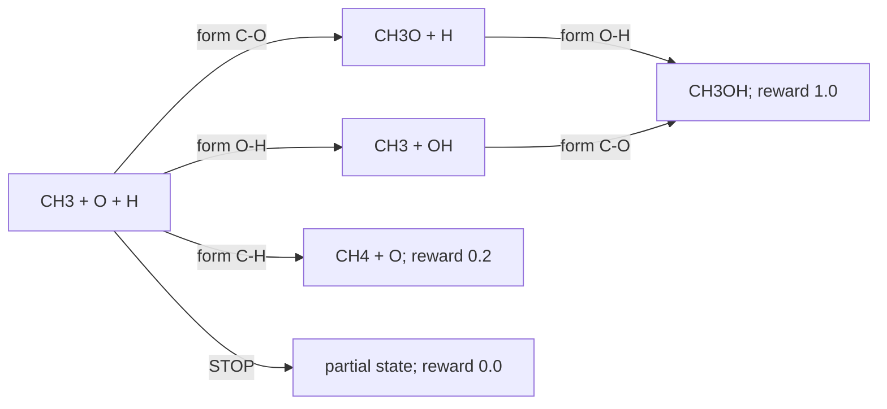

# Monte Carlo Tree Search: Deep Theory and a Comprehensive Chemical Example

## 1. What MCTS is

Monte Carlo Tree Search, usually abbreviated **MCTS**, is an online planning algorithm for sequential decision problems. It builds only the parts of a decision tree that appear useful, estimates the consequences of actions through simulations, and repeatedly balances:

- **exploitation**: revisit actions that currently look valuable;
- **exploration**: investigate actions whose values remain uncertain.

MCTS is especially useful when:

- the number of possible action sequences is enormous;
- a simulator can generate the state resulting from an action;
- an action may look unimportant immediately but become valuable several steps later;
- enumerating the complete decision tree is impossible;
- a learned policy or value function is available to guide the search.

MCTS was popularized by computer Go, but it is not inherently a game algorithm. It can also be used for single-agent planning, molecular generation, reaction-pathway exploration, scheduling and control.

The essential idea is:

```text
Use the current model to explore possible futures,
then use the simulated futures to make a better current decision.
```

## 2. Sequential-decision formulation

MCTS is most naturally described using a Markov decision process. An MDP is

$$
\mathcal M
=
(\mathcal S,\mathcal A,T,R,\gamma),
$$

where:

- $\mathcal S$ is the state space;
- $\mathcal A(s)$ is the set of legal actions in state $s$;
- $T(s'\mid s,a)$ is the transition model;
- $R(s,a,s')$ is the immediate reward;
- $\gamma\in[0,1]$ is the discount factor.

In a deterministic environment,

$$
s'=T(s,a).
$$

The return from step $t$ is

$$
G_t
=
r_{t+1}
+\gamma r_{t+2}
+\gamma^2r_{t+3}
+\cdots.
$$

The optimal action value is

$$
Q^*(s,a)
=
\mathbb E
\left[G_t\mid s_t=s,a_t=a\right]
$$

under optimal future decisions.

MCTS does not need to calculate $Q^*$ exactly over the full state space. It builds a local search tree rooted at the current state and estimates useful action values only where the search spends computation.

## 3. What is stored in the search tree

For each explored state-action edge $(s,a)$, MCTS commonly stores:

| Symbol | Meaning |
|---|---|
| $N(s)$ | Number of visits to state $s$ |
| $N(s,a)$ | Number of simulations that selected action $a$ from $s$ |
| $W(s,a)$ | Sum of backed-up returns through edge $(s,a)$ |
| $Q(s,a)$ | Mean backed-up return, $W(s,a)/N(s,a)$ |
| $P(s,a)$ | Optional prior probability supplied by a policy |

The empirical action value is

$$
Q(s,a)
=
\frac{W(s,a)}{N(s,a)}
$$

when $N(s,a)>0$.

A **tree node** represents a state. A **tree edge** represents an action leading to a successor state. The tree is rooted at the real state where a decision must be made.

It is important to distinguish three objects:

1. The real environment state.
2. A temporary simulated state inside the search.
3. The stored statistics associated with that state or its incoming actions.

The simulations must not accidentally mutate the real environment.

## 4. The four stages of one MCTS simulation

One MCTS search normally performs many simulations. Each simulation has four conceptual stages.

### 4.1 Selection

Starting at the root, repeatedly choose a child according to a tree policy. The tree policy should prefer actions with high estimated value while reserving some computation for uncertain actions.

Selection continues until the simulation reaches:

- a terminal state;
- an unexpanded state;
- a depth limit;
- a state chosen for partial expansion.

### 4.2 Expansion

When a previously unexpanded state is reached, add information about its legal actions to the search tree. Expansion may add:

- every legal action;
- only the highest-prior actions;
- a gradually increasing subset through progressive widening.

### 4.3 Evaluation

Estimate the value of the newly reached state. Classical MCTS uses a rollout policy that simulates until termination. Neural MCTS can instead use a learned value network:

$$
v=V_\theta(s).
$$

A hybrid method may perform a short rollout and then bootstrap from a value model.

### 4.4 Backup

Propagate the evaluation backward through every selected edge on the simulation path. Each edge visit count and accumulated value are updated.

For an undiscounted single-agent problem with terminal evaluation $z$:

$$
N(s,a)\leftarrow N(s,a)+1,
$$

$$
W(s,a)\leftarrow W(s,a)+z,
$$

$$
Q(s,a)\leftarrow\frac{W(s,a)}{N(s,a)}.
$$

The next simulation uses these improved statistics.

## 5. Why selection requires an exploration bonus

If selection always chooses the action with the largest current $Q$, an action that was unlucky during its first simulation might never be reconsidered. MCTS therefore treats the actions at a node like the arms of a multi-armed bandit.

### 5.1 The UCB idea (Upper Confidence Bound)

Suppose action $a$ has been tried $n_a$ times and has empirical mean reward $\widehat\mu_a$. For rewards bounded in $[0,1]$, concentration inequalities imply that the error in the empirical mean decreases approximately as

$$
O\left(\sqrt{\frac{\log t}{n_a}}\right),
$$

where $t$ is the total number of trials.

An upper-confidence estimate therefore has the general form

$$
\operatorname{UCB}(a)
=
\widehat\mu_a
+
c\sqrt{\frac{\log t}{n_a}}.
$$

The first term exploits known reward. The second term is large when the action is insufficiently explored.

### 5.2 UCT (Upper Confidence Bounds applied recursively to Trees)

Upper Confidence Bounds applied recursively to Trees gives the UCT rule:

$$
a^*
=
\underset{a\in\mathcal A(s)}{\operatorname{argmax}}
\left[
Q(s,a)
+
c_{\mathrm{uct}}
\sqrt{
\frac{\log N(s)}{N(s,a)}
}
\right].
$$

An unvisited action is normally assigned an infinite exploration score or is selected before revisiting fully explored actions.

The constant $c_{\mathrm{uct}}$ determines the strength of exploration:

- small $c_{\mathrm{uct}}$: greedier and more exploitative;
- large $c_{\mathrm{uct}}$: more exploratory;
- $c_{\mathrm{uct}}=0$: pure exploitation.

UCT has useful asymptotic convergence properties under suitable assumptions, but finite-computation performance can still be poor when:

- rewards are extremely delayed;
- the branching factor is huge;
- one rare sequence produces nearly all reward;
- rollout estimates are noisy or biased;
- the depth required to see a difference is very large.

## 6. PUCT: incorporating a learned policy (Predictor +UCT)

If a neural policy predicts a prior probability $P_\theta(s,a)$, MCTS can explore actions in proportion to their predicted promise. A common PUCT rule is

$$
a^*
=
\underset{a}{\operatorname{argmax}}
\left[
Q(s,a)
+
c_{\mathrm{puct}}
P_\theta(s,a)
\frac{\sqrt{\sum_bN(s,b)}}{1+N(s,a)}
\right].
$$

Define

$$
U(s,a)
=
c_{\mathrm{puct}}
P_\theta(s,a)
\frac{\sqrt{\sum_bN(s,b)}}{1+N(s,a)}.
$$

Then selection maximizes

$$
Q(s,a)+U(s,a).
$$

Interpretation:

- $Q$ records what search simulations discovered;
- $P$ records what the policy believed before searching;
- the numerator grows as the parent receives more visits;
- the denominator suppresses actions already explored many times.

A strong prior receives early attention, but a weak prior can still be explored as the parent's visit count grows—provided its prior is not exactly zero.

### 6.1 Valid-action masking

Invalid actions must be removed before normalizing policy probabilities:

$$
P(a\mid s)
=
\frac{
\exp(\ell_a)\,\mathbf 1[a\text{ is legal}]
}{
\sum_b\exp(\ell_b)\,\mathbf 1[b\text{ is legal}]
}.
$$

A hard physical constraint should normally be represented by the action mask, not merely by a negative reward after the invalid action is taken.

### 6.2 Root exploration noise

During training, AlphaZero-style systems often perturb the root prior:

$$
P'(s,a)
=
(1-\epsilon)P(s,a)
+
\epsilon\eta_a,
$$

where

$$
\eta\sim\operatorname{Dirichlet}(\alpha).
$$

Noise is generally added only at the root of a training search, not at every internal node and not during deterministic evaluation.

## 7. Correct backup with rewards and discounting

Suppose a simulation produces

$$
s_0,a_0,r_1,s_1,a_1,r_2,\ldots,s_L
$$

and the leaf evaluator returns $V(s_L)$. Define

$$
G_L=V(s_L).
$$

Moving backward:

$$
G_k
=
r_{k+1}+\gamma G_{k+1}.
$$

The edge $(s_k,a_k)$ receives $G_k$.

### 7.1 Single-agent planning

In molecular design or reaction exploration, all depths usually share the same objective. Do **not** alternate the sign during backup.

### 7.2 Two-player zero-sum games

If values are expressed from the current player's perspective, the player changes at each turn and the backed-up value commonly changes sign:

$$
G_k=-G_{k+1}.
$$

Incorrectly copying this sign reversal into a single-agent chemistry problem will train the search to fight against itself.

### 7.3 Terminal values versus truncated values

A terminal state has a defined outcome. A truncated search stops only because computation, time or depth ran out. These should not automatically receive the same value.

At a depth limit, use a value estimate such as

$$
G_L=V_\theta(s_L),
$$

rather than pretending the state has zero value.

## 8. From visit counts to the selected action

After $B$ simulations, MCTS returns a refined action distribution based on root visit counts:

$$
\pi_{\mathrm{MCTS}}(a\mid s)
=
\frac{N(s,a)^{1/\tau}}
{\sum_bN(s,b)^{1/\tau}}.
$$

The temperature $\tau$ controls decision randomness:

- high $\tau$: flatter and more exploratory;
- $\tau=1$: probabilities proportional to visit counts;
- $\tau\rightarrow0$: select the most visited action.

Visit count is usually preferred over the largest raw $Q$ because visit count reflects both value and the search's allocation of uncertainty.

After choosing the real action, the root can move to the corresponding successor and retain that explored subtree. Statistics unrelated to the new root can be discarded.

## 9. Neural policy-value MCTS

A policy-value network produces two outputs from a state:

$$
(P_\theta(s,\cdot),V_\theta(s)).
$$

The policy supplies priors for expansion. The value replaces or supplements costly rollouts.

### 9.1 Training target

For each real state visited during an episode, store

$$
(s_t,\pi_t,z),
$$

where:

- $\pi_t$ is the MCTS root visit distribution;
- $z$ is the eventual episode return.

A common loss is

$$
\mathcal L(\theta)
=
-\pi_t^\mathsf T\log P_\theta(s_t)
+
\lambda_V
\left(V_\theta(s_t)-z\right)^2
+
\lambda_2\|\theta\|_2^2.
$$

The first term teaches the policy to imitate the search-improved action distribution. The second teaches the value head to predict final outcomes.

This creates a policy-improvement loop:

```text
network guides MCTS
        ↓
MCTS produces a better policy target
        ↓
network learns from the target
        ↓
improved network guides the next searches
```

This is different from ordinary REINFORCE-style policy gradient. The policy is trained primarily against MCTS visit targets rather than directly multiplying log-probabilities by sampled returns.

## 10. Pseudocode

```text
function MCTS_SEARCH(root_state, simulation_budget):
    expand root_state with policy priors

    repeat simulation_budget times:
        state ← copy(root_state)
        path ← empty list

        while state is expanded and not terminal:
            action ← argmax_a [Q(state,a) + exploration_bonus(state,a)]
            append (state, action) to path
            state ← simulator.step(state, action)

            if state repeats a state already on this path:
                handle cycle and stop simulation

        if state is terminal:
            value ← terminal_return(state)
        else:
            priors, value ← policy_value_network(state)
            expand state using legal priors

        for (parent_state, action) in reverse(path):
            value ← immediate_reward(parent_state, action) + gamma × value
            N(parent_state, action) ← N(parent_state, action) + 1
            W(parent_state, action) ← W(parent_state, action) + value
            Q(parent_state, action) ← W(parent_state, action) / N(parent_state, action)

    return normalized root visit counts
```

## 11. Trees, transpositions and cycles

### 11.1 Transpositions

A transposition occurs when two different action sequences reach the same state:

$$
s_0\xrightarrow{a_1}s_1\xrightarrow{a_2}s_3,
$$

$$
s_0\xrightarrow{a_2}s_2\xrightarrow{a_1}s_3.
$$

The search structure is then more accurately a directed acyclic graph than a tree. A transposition table maps a canonical state key to an existing search node.

Benefits include:

- avoiding duplicate neural evaluations;
- sharing knowledge about equivalent states;
- reducing memory;
- counting each unique chemical state once.

Care is required because edge statistics can remain parent-specific even when the successor node is shared.

### 11.2 Cycles

Reversible actions can create cycles:

$$
s_0\xrightarrow{\text{form bond}}s_1
\xrightarrow{\text{break same bond}}s_0.
$$

Useful defenses are:

- maintain a set of canonical states on the current simulation path;
- stop or penalize a repeated state;
- impose a maximum simulation depth;
- discourage immediate inverse actions;
- use a `STOP` action;
- separate the transposition table from path-specific cycle detection.

A transposition is not automatically a cycle. A state reached by two acyclic paths should be shared; a state repeated on the same path must be handled to prevent an infinite simulation.

## 12. Large or continuous action spaces

Expanding every legal action may be impossible. Progressive widening restricts the number of expanded children:

$$
|\mathcal C(s)|
\leq
kN(s)^\alpha,
$$

where $k>0$ and $0<\alpha<1$.

As a state receives more visits, additional actions are admitted. The new actions can be proposed by:

- a learned policy;
- top-$k$ action logits;
- domain heuristics;
- random samples from a continuous action distribution;
- hierarchical selection, such as molecule pair followed by atom pair.

For molecular graphs with $N$ atoms, all unordered pairs scale as

$$
\frac{N(N-1)}{2}=O(N^2).
$$

A policy should score these pairs with vectorized tensor operations and may eventually need candidate pruning or hierarchical proposals.

## 13. Stochastic environments

When $T(s'\mid s,a)$ is stochastic, selecting the same action can produce different successor states. Options include:

- sample one successor per simulation;
- introduce explicit chance nodes;
- store outcome distributions under an action;
- use double progressive widening for actions and outcomes.

The backed-up value then estimates an expectation over both decisions and environmental outcomes.

In a chemical setting, stochasticity could represent uncertain reaction outcomes, uncertain barriers, or stochastic molecule encounters. A deterministic graph-edit simulator does not represent these uncertainties unless they are explicitly added.

## 14. Parallel and batched MCTS

Neural evaluation is often the main cost. Multiple simulations can collect unevaluated leaves and evaluate them as a batch on the GPU.

If several workers search the same tree, **virtual loss** temporarily discourages them from selecting the same path. When the real evaluation arrives, the virtual update is removed and replaced by the true value.

Parallel MCTS must synchronize updates carefully. Lost visit increments or partially updated $N$, $W$ and $Q$ values can materially change the search.

## 15. Computational cost

Let:

- $B$ be the number of simulations per real decision;
- $D$ be the mean simulation depth;
- $C_T$ be transition cost;
- $C_V$ be leaf-evaluation cost.

The approximate cost per real action is

$$
O\left(B(DC_T+C_V)\right).
$$

Memory is approximately proportional to the number of unique expanded states and stored action edges.

Useful engineering techniques include:

- reuse the selected subtree after each real action;
- cache neural evaluations by canonical state key;
- batch leaf evaluations;
- prune very low-prior actions cautiously;
- use progressive widening;
- cap depth and simulation count;
- profile state copying, which can dominate in graph environments.

## 16. Comprehensive example: C/H/O graph search

This example is deliberately small enough to calculate and run. It illustrates policy priors, PUCT, value estimates, backup, transpositions, terminal rewards and visit-count decisions.

### 16.1 Initial state

Suppose the oven contains:

- one methyl fragment, $\mathrm{CH_3}$, with one available carbon valence;
- one oxygen atom with two available valences;
- one hydrogen atom with one available valence.

The simplified graph-valid actions are:

1. form C–O;
2. form O–H;
3. form C–H;
4. stop.

Two action orders can construct methanol:



The two paths to methanol form a transposition. A canonical state table should recognize that they reach the same final molecular graph.

This is a pedagogical valence model, not a complete electronic-structure description. Real combustion modeling requires explicit radical and charge information.

### 16.2 Initial policy and value

Assume the policy-value network returns:

| Root action | Prior $P(s_0,a)$ |
|---|---:|
| form C–O | 0.45 |
| form O–H | 0.30 |
| form C–H | 0.20 |
| `STOP` | 0.05 |

and

$$
V(s_0)=0.45.
$$

At the C–O intermediate, suppose

$$
P(\text{form O-H})=0.85,
\qquad
P(\text{STOP})=0.15,
$$

$$
V(s_{\mathrm{CO}})=0.70.
$$

At the O–H intermediate, suppose

$$
P(\text{form C-O})=0.80,
\qquad
P(\text{STOP})=0.20,
$$

$$
V(s_{\mathrm{OH}})=0.60.
$$

These value estimates are imperfect. Search can correct them after it reaches the terminal methanol reward.

### 16.3 One numerical PUCT selection

Suppose that after seven simulations the root statistics are:

| Action | $P$ | $N$ | $Q$ |
|---|---:|---:|---:|
| form C–O | 0.50 | 4 | 0.875 |
| form O–H | 0.30 | 2 | 0.750 |
| form C–H | 0.20 | 1 | 0.200 |

For this arithmetic illustration, ignore `STOP`, let $c_{\mathrm{puct}}=1.5$, and use

$$
\sqrt{\sum_bN(s,b)}=\sqrt 7\approx2.6458.
$$

For C–O:

$$
U_{\mathrm{CO}}
=
1.5(0.50)
\frac{2.6458}{1+4}
\approx0.3969,
$$

$$
Q+U
=
0.875+0.3969
=
1.2719.
$$

For O–H:

$$
U_{\mathrm{OH}}
=
1.5(0.30)
\frac{2.6458}{1+2}
\approx0.3969,
$$

$$
Q+U
=
0.750+0.3969
=
1.1469.
$$

For C–H:

$$
U_{\mathrm{CH}}
=
1.5(0.20)
\frac{2.6458}{1+1}
\approx0.3969,
$$

$$
Q+U
=
0.200+0.3969
=
0.5969.
$$

The search selects C–O because it has the largest $Q+U$ score.

Notice that the three exploration bonuses happen to be equal in this constructed snapshot. Their different priors are exactly balanced by their different visit counts. The value estimates therefore decide the selection.

### 16.4 Backup example

Suppose a simulation follows

```text
CH3 + O + H
    → CH3O + H
    → CH3OH
```

and receives terminal value

$$
z=1.0.
$$

With no intermediate reward and $\gamma=1$, both selected edges receive $1.0$.

If the root C–O edge previously had

$$
N=4,
\qquad
W=3.5,
\qquad
Q=0.875,
$$

then backup gives

$$
N\leftarrow5,
$$

$$
W\leftarrow4.5,
$$

$$
Q\leftarrow\frac{4.5}{5}=0.9.
$$

If a step cost of $-0.02$ and $\gamma=0.99$ were used, with a final transition reward of $0.98$, the root return would instead be

$$
G_0
=
-0.02+0.99(0.98)
=
0.9502.
$$

This makes shorter successful paths slightly preferable.

### 16.5 Full executable Python example

The following program uses only the Python standard library. It implements:

- a deterministic toy chemistry environment;
- legal action generation from simplified valence capacity;
- a policy-value model;
- PUCT selection;
- expansion and terminal evaluation;
- backup;
- a state table that naturally shares transpositions;
- visit-count reporting.

```python
from dataclasses import dataclass, field
from math import sqrt


STOP = "STOP"


@dataclass(frozen=True)
class ToyState:
    """Bond-presence state for C-O, O-H, and C-H candidate bonds."""

    co: int = 0
    oh: int = 0
    ch: int = 0
    stopped: bool = False


class ToyChemistry:
    """Small deterministic graph-edit environment."""

    def is_terminal(self, state):
        methanol = state.co == 1 and state.oh == 1
        methane_route = state.ch == 1
        return state.stopped or methanol or methane_route

    def terminal_value(self, state):
        if state.co == 1 and state.oh == 1:
            return 1.0
        if state.ch == 1:
            return 0.2
        return 0.0

    def valid_actions(self, state):
        if self.is_terminal(state):
            return []

        # Initial free capacities are C:1, O:2, H:1.
        c_free = 1 - state.co - state.ch
        o_free = 2 - state.co - state.oh
        h_free = 1 - state.oh - state.ch

        actions = []
        if not state.co and c_free > 0 and o_free > 0:
            actions.append("form_C-O")
        if not state.oh and o_free > 0 and h_free > 0:
            actions.append("form_O-H")
        if not state.ch and c_free > 0 and h_free > 0:
            actions.append("form_C-H")

        actions.append(STOP)
        return actions

    def next_state(self, state, action):
        if action not in self.valid_actions(state):
            raise ValueError(f"Illegal action: {action}")

        if action == "form_C-O":
            return ToyState(1, state.oh, state.ch)
        if action == "form_O-H":
            return ToyState(state.co, 1, state.ch)
        if action == "form_C-H":
            return ToyState(state.co, state.oh, 1)
        return ToyState(state.co, state.oh, state.ch, stopped=True)


class ToyPolicyValue:
    """Stand-in for a trained policy-value GNN."""

    def __call__(self, state, valid_actions):
        if state == ToyState():
            raw_priors = {
                "form_C-O": 0.45,
                "form_O-H": 0.30,
                "form_C-H": 0.20,
                STOP: 0.05,
            }
            value = 0.45
        elif state.co == 1 and state.oh == 0:
            raw_priors = {"form_O-H": 0.85, STOP: 0.15}
            value = 0.70
        elif state.oh == 1 and state.co == 0:
            raw_priors = {"form_C-O": 0.80, STOP: 0.20}
            value = 0.60
        else:
            raw_priors = {action: 1.0 for action in valid_actions}
            value = 0.0

        # Mask illegal actions and renormalize.
        normalizer = sum(raw_priors.get(a, 0.0) for a in valid_actions)
        priors = {
            action: raw_priors.get(action, 0.0) / normalizer
            for action in valid_actions
        }
        return priors, value


@dataclass
class EdgeStats:
    prior: float
    visits: int = 0
    value_sum: float = 0.0

    @property
    def q(self):
        if self.visits == 0:
            return 0.0
        return self.value_sum / self.visits


@dataclass
class SearchNode:
    edges: dict = field(default_factory=dict)


class MCTS:
    def __init__(self, environment, model, c_puct=1.5):
        self.environment = environment
        self.model = model
        self.c_puct = c_puct

        # Hashable ToyState keys form a transposition table.
        self.nodes = {}

    def expand(self, state):
        valid_actions = self.environment.valid_actions(state)
        priors, value = self.model(state, valid_actions)
        self.nodes[state] = SearchNode(
            edges={
                action: EdgeStats(prior=priors[action])
                for action in valid_actions
            }
        )
        return value

    def select_action(self, node):
        total_visits = sum(edge.visits for edge in node.edges.values())
        parent_scale = sqrt(total_visits + 1)

        def puct_score(action):
            edge = node.edges[action]
            exploration = (
                self.c_puct
                * edge.prior
                * parent_scale
                / (1 + edge.visits)
            )
            return edge.q + exploration

        return max(node.edges, key=puct_score)

    def simulate(self, root_state):
        state = root_state
        path = []

        while True:
            if self.environment.is_terminal(state):
                value = self.environment.terminal_value(state)
                break

            if state not in self.nodes:
                value = self.expand(state)
                break

            node = self.nodes[state]
            action = self.select_action(node)
            edge = node.edges[action]
            path.append(edge)
            state = self.environment.next_state(state, action)

        # Single-agent backup: do not alternate the sign.
        for edge in reversed(path):
            edge.visits += 1
            edge.value_sum += value

        return value

    def run(self, root_state, simulations):
        if root_state not in self.nodes:
            self.expand(root_state)

        for _ in range(simulations):
            self.simulate(root_state)

    def root_statistics(self, root_state):
        node = self.nodes[root_state]
        rows = []
        for action, edge in node.edges.items():
            rows.append(
                {
                    "action": action,
                    "prior": edge.prior,
                    "visits": edge.visits,
                    "Q": edge.q,
                }
            )
        return rows


environment = ToyChemistry()
model = ToyPolicyValue()
search = MCTS(environment, model, c_puct=1.5)

root = ToyState()
search.run(root, simulations=80)

rows = search.root_statistics(root)
total_visits = sum(row["visits"] for row in rows)

for row in rows:
    probability = row["visits"] / total_visits
    print(
        f"{row['action']:>10s}  "
        f"P={row['prior']:.2f}  "
        f"N={row['visits']:2d}  "
        f"Q={row['Q']:.3f}  "
        f"pi={probability:.4f}"
    )
```

Expected output is:

```text
  form_C-O  P=0.45  N=50  Q=0.974  pi=0.6250
  form_O-H  P=0.30  N=27  Q=0.948  pi=0.3375
  form_C-H  P=0.20  N= 3  Q=0.200  pi=0.0375
      STOP  P=0.05  N= 0  Q=0.000  pi=0.0000
```

### 16.6 Interpretation of the output

The original policy placed probabilities

$$
(0.45,0.30,0.20,0.05)
$$

on C–O, O–H, C–H and `STOP`. After search, the visit distribution is approximately

$$
(0.6250,0.3375,0.0375,0).
$$

Search increased probability on the two actions that can lead to methanol and suppressed the C–H route after observing its terminal reward of only $0.2$.

The root C–O and O–H values are slightly below $1.0$ because their first visits used imperfect neural leaf evaluations and occasional internal `STOP` selections returned zero. As more successful terminal simulations accumulate, their empirical means move toward the true high-value outcome.

The unvisited root `STOP` action is not necessarily a bug. With this finite budget, its low prior and zero value never make its PUCT score competitive. With enough visits, a positive-prior unvisited action eventually receives a growing exploration bonus. In production, root noise, forced initial exploration, or minimum visit rules can also be used when broader coverage is required.

## 17. Mapping this example to a GNN reaction environment

For a molecular environment, replace `ToyPolicyValue` with a GNN.

### 17.1 State encoding

Use:

- atom features $x_i$;
- existing bond features $e_{ij}$;
- message-passing `edge_index`;
- all candidate atom pairs;
- molecule/component features;
- global reactor conditions.

An edge-aware message-passing layer can use

$$
m_{i\leftarrow j}
=
\operatorname{MLP}
\left([h_i\Vert h_j\Vert e_{ij}]\right),
$$

$$
m_i
=
\sum_{j\in\mathcal N(i)}m_{i\leftarrow j},
$$

$$
h_i'
=
\operatorname{GRU}(m_i,h_i).
$$

### 17.2 Action logits

For each unordered candidate pair $(i,j)$, construct a symmetric pair embedding and predict separate formation and breakage logits:

$$
\ell_{ij,\Delta}^{\mathrm{form}},
\qquad
\ell_{ij,\Delta}^{\mathrm{break}},
$$

where $\Delta\in\{1,2,3\}$ is the bond-order change. Apply the environment masks before softmax.

### 17.3 Value

Pool atom embeddings within each molecule and then across the oven:

$$
g_s
=
\operatorname{Pool}
\left(
\left\{
\operatorname{Pool}(\{h_i:i\in m\})
:m\in s
\right\}
\right).
$$

Predict

$$
V_\theta(s)=\operatorname{MLP}_{\mathrm{value}}(g_s).
$$

### 17.4 Requirements before search

A mutable environment needs the following before MCTS can branch safely:

1. `clone()`, serialization, or an immutable `next_state()`;
2. a canonical, atom-order-independent state key;
3. a `STOP` action;
4. repeated-state detection;
5. flat action encoding and decoding;
6. separation of true termination from computational truncation.

## 18. Reward design for chemical discovery

MCTS optimizes exactly the reward it is given, not the scientific intention behind that reward. A possible discovery reward is

$$
r_t
=
w_1r_{\mathrm{new\ known\ species}}
+
w_2r_{\mathrm{physical\ plausibility}}
-
w_3r_{\mathrm{cycle}}
-
w_4r_{\mathrm{step}}.
$$

Potential evaluation signals include:

- first-time discovery of a reference species;
- predicted reaction barrier;
- thermodynamic stability;
- kinetic accessibility or flux;
- valence, charge and radical validity;
- novelty after physical screening;
- penalty for returning to a repeated state.

Bond dissociation energy can bias breakage exploration, but it is not generally equal to the reaction activation energy. A BDE-derived term is better treated as a calibrated prior or value feature than as a complete probability of reaction.

## 19. MCTS versus Q-learning

Both methods estimate future value, but they allocate computation differently.

| Property | MCTS | Q-learning |
|---|---|---|
| Planning | Performs online search at decision time | Usually selects directly from learned $Q_\theta$ |
| Transition model | Requires a simulator/model | Can learn without explicit planning model |
| Computation per action | High | Low after training |
| Adaptation to a new state | Can search locally | Relies mainly on generalization |
| Sparse delayed rewards | Search can help | Often difficult without replay/curriculum |
| Variable masked actions | Natural with child generation | Requires masked action-value scoring |

They can be combined. A learned $Q$ or value network can evaluate leaves, while MCTS performs local improvement. MCTS-generated experience can also train the network that later reduces the amount of search required.

## 20. Common failure modes

### 20.1 Wrong state identity

Chemically identical graphs with different atom numbering are stored separately, destroying transposition sharing and ground-truth matching.

### 20.2 In-place branch corruption

One simulation mutates a shared parent, so later simulations start from the wrong chemical state.

### 20.3 Reward hacking

The search repeatedly creates duplicate rewarded species, prefers fragmentation because each fragment is counted, or exploits a surrogate outside its reliable domain.

### 20.4 Missing cycle control

Formation and immediate breakage repeat forever.

### 20.5 Incorrect value perspective

Single-agent values are sign-flipped as if the problem had two opposing players.

### 20.6 Priors that eliminate exploration

Promising actions receive exactly zero prior and can never acquire a PUCT exploration bonus.

### 20.7 Uncalibrated $Q$ and exploration scales

If returns have magnitude $10^4$ while exploration bonuses are near $1$, $c_{\mathrm{puct}}$ has essentially no effect. Normalize or bound values, or tune the exploration coefficient consistently with the reward scale.

### 20.8 Treating truncation as failure

Depth-limited leaves are assigned zero even when they are one step from a valuable species. Use the value head at truncated leaves.

### 20.9 Too much branching

Most simulations are spent expanding chemically irrelevant atom pairs. Use masks, policy priors, hierarchical action proposals or progressive widening.

### 20.10 Overtrusting the value network

MCTS concentrates on regions where a biased surrogate is overoptimistic. Periodically validate high-value discoveries with stronger calculations and retrain the surrogate.

## 21. Practical implementation checklist

- [ ] Deterministic state clone or immutable transition
- [ ] Canonical state hash
- [ ] Legal-action mask
- [ ] Explicit terminal and truncated conditions
- [ ] `STOP` action
- [ ] PUCT selection with tested numerical scale
- [ ] Terminal and leaf-value handling
- [ ] Correct single-agent backup
- [ ] Repeated-state detection
- [ ] Transposition table
- [ ] Root visit-count policy
- [ ] Replay buffer containing state, search policy and outcome
- [ ] Policy-value loss
- [ ] Fixed random seeds for tests
- [ ] Unit tests on a tiny tree with analytically known values
- [ ] Profiling of state copying and neural evaluation
- [ ] Evaluation without root noise
- [ ] Ablations without MCTS and without learned priors

## 22. Recommended learning progression

1. Implement MCTS on a tiny deterministic tree and verify every $N$, $W$ and $Q$ update manually.
2. Run the executable toy chemistry example in this document.
3. Connect MCTS to a cloned molecular environment using a hand-written policy and reward.
4. Replace the hand-written policy with an untrained GNN and confirm masking and tensor shapes.
5. Supervise the policy on known one-step reactions if available.
6. Train the value head on completed trajectories.
7. Generate MCTS visit targets and train the joint policy-value model.
8. Add transpositions, batching and candidate pruning only after the basic search is correct.
9. Validate proposed species with held-out mechanisms or stronger chemical calculations.

## 23. Further reading

- Kocsis and Szepesvári, **“Bandit Based Monte-Carlo Planning”** (2006): foundational UCT work.
- Browne et al., **“A Survey of Monte Carlo Tree Search Methods”** (2012): broad theory and application survey.
- Silver et al., **“Mastering the Game of Go with Deep Neural Networks and Tree Search”** (2016): neural policy/value guidance with MCTS.
- Silver et al., **“Mastering the Game of Go without Human Knowledge”** (2017): AlphaGo Zero training loop.
- [Lee, Kim and Kim, “Efficient Construction of a Chemical Reaction Network Guided By a Monte Carlo Tree Search”](https://doi.org/10.1002/syst.201900057) (2020).
- [Sowndarya et al., “Multi-objective Goal-directed Optimization of De Novo Stable Organic Radicals for Aqueous Redox Flow Batteries”](https://doi.org/10.1038/s42256-022-00506-3) (2022): AlphaZero-style MCTS with graph neural networks and molecular graph actions.

## 24. Final perspective

MCTS is not merely random simulation. It is a disciplined procedure for allocating a limited planning budget. The policy proposes where to look, the value function estimates unexplored futures, the search statistics correct the model using simulated outcomes, and visit counts convert that evidence into a decision.

For chemical-species discovery, the most important practical ingredients are not only the PUCT equation. They are:

- a chemically meaningful state and action representation;
- safe independent simulation branches;
- canonical graph identity;
- physically sensible masks and rewards;
- explicit handling of reversible cycles;
- uncertainty-aware validation of high-value discoveries.

When these pieces are correct, MCTS provides a natural bridge between a GNN's learned chemical intuition and explicit multi-step exploration of reaction possibilities.
