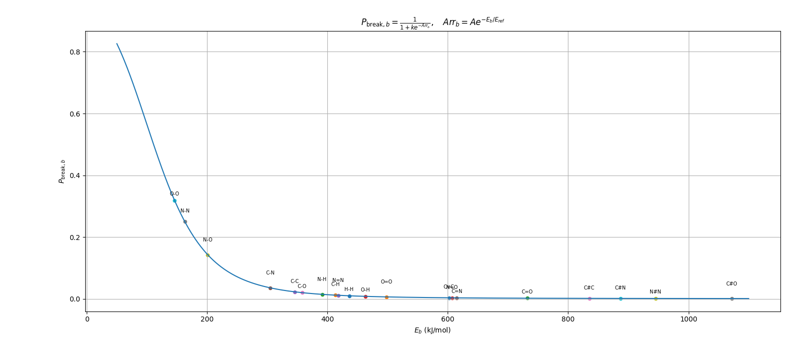
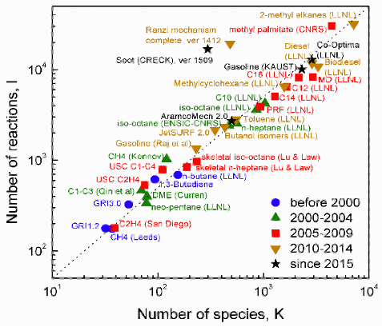
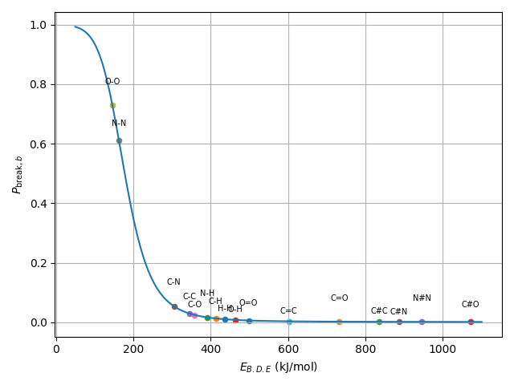

## Jun. 10th, 2026

Three types of GNN layers [Link](https://www.youtube.com/watch?v=uF53xsT7mjc)
[summary](08062026/summary.md)

### Potential Scope of the project
<span style="color:blue">For chemistry discovery purpose, can we describe the scope of the project to be: finding the intermediate chemistry species, incorporating which may have significant improvement in combustion modeling.</span>
OR
<span style="color:blue">Can we produce a surrogate model that 1. satisfy chemistry laws and 2. the existence of this 1 species may replace several other species that presents in a given kinetic model</span>
IRREVALENT
<span style="color:blue">Use GNN for producing skeleton model </span>
### Read through ``obsolete/tutorial/3_train_small.py``
* <span style="color:red">Question: </span> about ``3_train_small.py``: Is there a repeated definition about the edge index between ``line 77-78``?
* <span style="color:red">Question: </span> higher bond order -> shorter bond length -> stronger bond. <span style="color:green">why do we want to train B.O. and bond existence separately? </span> <span style="color:red">Existence is for nodal existence</span> 
<span style="color:blue">Understanding </span> about the ```3_train_small.py```: create 100 datasets, each dataset contains 4 nodes (H, H, O, O) the bond are randomly generated s.t. either all atoms are connected or non of them are connect. The dist and other parameters are defined uniformly too.

The training is to train the bond_predictor & existence_predictor to recognise (predict) the bond order and bond existence.

The training loss consists of MSELoss on bond order and BCELoss on existence

<span style="color:red">Caveats: </span>
* As mentioned in question before
* Uniformly definition of distance, B.O. etc.
* y_bond & y_exist are very simple

### Read through ``obsolete/tutorial/6_bo_4node.py``
* <span style="color:green">Major difference:</span> ``CombustionConv`` has aggregator of mean instead of add
* <span style="color:green">Major difference:</span> Instead of having 16 input features each for two atoms, it now has 193 inputs. 
* <span style="color:green">Major difference:</span> introduce sum, abs_diff, multi, 4 types of commutative operator manufactured features.

<span style="color:blue">Understanding </span>about ``/tutorial/4_bo_4node.py``: still have a small 4 atoms training data.

A sample_type template has been given as a list that contains ``2 H + 2 O``. The algorithm then generate 1000 sample examples from the sample_type template. Sample example differ from each other by:
* having different indices for each atom (for example: template(0) has ('H', 'H', 'O', 'O'), but the indices can be (1,2,3,4) or (2,4,1,3)) <span style="color:red">CHALLENGE but haven't proof it : permutation invariance and equivariance </span>
* for each case, when there is a bond formation, the distance is then between 0.7 to 1.6, and when there is no bond formation, the distance is between 2.2 to 3.5
* assign the bond value of each connected pair using bonded Pauling's formula (taken into account of the pairing between different species)

## Thoughts
* for any atom that has $\textit{n}$ features, let's have $m$ features that is identical across same elements and $n-m$ species that has features related to the bond formation.
* How to distinguish OH and OH*?

## Jun. 17th, 2026
### Concept of graph reinforcement learning: potentially applicable to GNN based skeletal kinetic model production [Link](../../tutorial/graphReinforcement/graph_reinforcement_learning_case.md)

### Literature Search on Adaptive Chemistry
* Further literature for the Adaptive Chemistry [Link](../../../AdaptiveChemistry/model_reduction_papers.md)
* Exciting discovery on Spatial Reduction papers [Link](../../../SpatialReduction/literature/adaptive_chemistry_spatial_treatment_literature.md) (in total 27 papers)

## Jul. 1st, 2026

#### Discussing Points
1. GNN Literature
	1. Literature: [ConnorBIll2019](../literature/ConnorBill2019/ConnorBill2019.pdf)
	2. Encoding atomic number, formal charge, degree of connectivity, explicit and implicit valence, and aromaticity to nodal information.
	3. Weisfeiler-Lehman Network, Candidate Ranking via W-L Difference Network, and Attention Mechanism (WL: 1 neighbour? (bond information) multiple neighbours (bond information does not change)?)
	4. Maximum 5 bond forming/breaking (collision frequency? T? P?)
2. GNN Xu-RL Code
	1. (as shown below,) potential improvement on encoding valence rule with a scale (instead of 1 for getting bond, 0 for not getting bond) & similar for connection logit.
	2. Might be a good idea to incorporate energy (represented by bond order)
	3. Question: No O2--> more run should be sufficient to find
	4. Question: don't want H-O-O-...-O-H --> Energy (bond order?)
### Read GNN-RL [CodeLink](../gnn_combustion/Xu_training/RL/grow_train_animation.py)     [README_gpt](../gnn_combustion/Xu_training/RL/README_gpt.md)
#### class AdvanceMoleculeEnv
* *def get_pyg_data*: <span style="color:blue">Encode info</span>
	* nodal encoding: one hot feature (H:[1,0]; O:[0,1])
	* edge encoding: a <span style="color:red">2 by 2n matrix, undirected edge encoding</span>
* def *get_valid_action_masks*: <span style="color:blue">Mask out using valence rule</span>
	* valance rule hard encoded. Only bonds between atoms with spare capacity and that aren't already connected are allowed. <span style="color:red">CAVEAT?</span>
	* <span style="color:red">The "node_grow_mask" is either 1 (able to grow on) or 0 (max valency),could be problematic since the information is not enough</span> 
	* <span style="color:blue">This may also prevent species such as "H*" appear as valid species</span> (though not appeared in the valid species list)
	* refactor local nodal indices to global nodal indices for different epoch, also create possible bonding
* def *step*:<span style="color:blue"> Grow, connect, or terminate</span>
	* Define three update actions to the environment: <span style="color:green">growth, connection, and terminate</span> 
	* <span style="color:blue">growth</span>: add a new atom and create its bond-count entry. 
	* <span style="color:blue">connection</span>: add the global edge, update valency counts, and merge the two connected components so the environment knows those atoms now belong to the same molecule. After the growth, apply function <span style="color:red">get_valid_action_masks</span> to mask out atoms that is no longer available. 
* def *evaluate_inventory*: <span style="color:blue"> Convert each component into a formula string</span> 

#### class GrowthGNN
* def _init_: <span style="color:blue"> define MLP architecture</span> 
	* 2 MLP layer with _"hidden_dim"_ number of protons, then this architecture is connected to <span style="color:blue"> grow_head, connect_head, and termination_layer</span> 
* def _forward_: <span style="color:blue"> forward passing the neural network to generate grow_logits, connect_logits, & term_logit</span> 
	* In *grow_logit*, a very large negative number has been added to curb an invalid chemical growth <span style="color:red">CAVEAT?</span>
	* Similar for connect_logit <span style="color:red">CAVEAT?</span>
	* Termination layer uses the mean of all atoms with the termination_layer output


#### Training Loop
*This is closer to a compact policy-gradient-style toy loop than to supervised training: there are no labeled target graphs. The model is rewarded when the final disconnected fragments are all valid H/O species.*

## July. 8th, 2026
<span style="color:red">Question:</span> H-O-O-...-O-H is not sustainable, <span style="color:blue">how to penalize?</span>
<span style="color:red">Question:</span> How to penalize long chain hydrocarbon? 

### Bond dissociation energy/ Bond strength:
Average Bond Enthalpies (kJ/mol) at 25 °C[Link](https://owl.oit.umass.edu/departments/Chemistry/appendix/bond.html)
#### Single Bonds

|     |   H |   C |   N |   O |
| --- | --: | --: | --: | --: |
| H   | 436 | 413 | 391 | 463 |
| C   | 413 | 346 | 305 | 358 |
| N   | 391 | 305 | 163 | 201 |
| O   | 463 | 358 | 201 | 146 |

#### Multiple Bonds

| Double Bond | kJ/mol | Triple Bond | kJ/mol |
| ----------- | -----: | ----------- | -----: |
| C=C         |    602 | C≡C         |    835 |
| O=O         |    498 |             |        |
| C=O         |    732 | C≡O         |   1072 |
| N=O         |    607 |             |        |
| N=N         |    418 | N≡N         |    945 |
| C=N         |    615 | C≡N         |    887 |
# An idea: mapping bond dissociation energy to the probability of single bond breaking 
[Link](Mapping_E_to_P.pdf) 
<span style="color:blue">Improve this idea:</span>
* Instead of using Arrhenius equation, where $Arr = Ae^{-\frac{E_a}{RT}}$, we should use just $e^{-\frac{E_a}{RT}}$ since Arrhenius has unit but $e^{-\frac{E_a}{RT}}$ doesn't
* In reaction, the Arrhenius term multiply with concentrations of reactants. In here we only consider <span style="color:red">self-dissociation</span>.
* Instead of using "RT", we should use a tunable parameter for the <span style="color:red">learning purpose</span>.

[Summary of This Idea](mapping_E_to_P.md)

[Simple validation of this idea](../penalize_long_chain/validate_Eb_to_P/simple_validation.py)


## Concept proof the idea:
* Find a reaction kinetic model <span style="color:blue">full of long chain hydrocarbon</span>.
* Use this as a training model, train a <span style="color:blue">algorithm</span> or a <span style="color:red">neural network</span>.
* Try some other chemical species, see the probability of existence.

_The directory of this concept proof is stored under_ `GGN_discover_species/penalize_long_chain` [README](../penalize_long_chain/README.md)

## Detailed kinetic models 

_Stored under 'GNN_discover_species/penalize_long_chain/mechanism_file_chemkin'_ 
It contains [JetSurF2.0](https://web.stanford.edu/group/haiwanglab/JetSurF/JetSurF2.0/Index.html),  [LLNL models](https://combustion.llnl.gov/archived-mechanisms/alkanes/n-heptane-detailed-mechanism-version-2) including C8-C16 and $\ce{C7H16}$ (n-Heptane), and [2-methyl alkanes(LLNL)](https://combustion.llnl.gov/sites/combustion/files/c7_c20_2methylalkanes_c8_c16_nalkanes_v1.1_mech_CnF_inp.txt) 

<span style="color:red">Use LLNL C8-16 & C7H16 model only</span>

* A side-note for those detailed kinetic models: they <span style="color:red">do not contain N chemistries</span> [summary](../penalize_long_chain/output/log_master_dataset.txt) 
* Within the `class identify_backbone_from_chemkin_mechanism`, *BOND_KEYS* contains <span style="color:red">20 types of bonds</span>, *EXACT_SPECIES* contains <span style="color:red">60 basic species</span> as a small chemistry knowledge table
* <span style="color:blue">(Maybe not a problem but)</span> we do not distinguish isomers because it is a <span style="color:red">SUBGRAPH FEATURE</span>. Isomers are <span style="color:red">degeneracies</span> for this subgraph feature. 

### Read Detailed Kinetic Model Feature .json file

```json
{
	# formulae that map to more than one formula degeneracy
	"ambiguous_formulae":{
		"C2H3O": [

			"C2H3O_001",
			
			"C2H3O_002",
			
			"C2H3O_003"
			
		],
	},
	# Grouped entries with the same estimated formula, bond counts, and ring flag
	"formula_degeneracies":{     # the parser found one group of species with the same estimated formula, bond counts, and ring flag
		"C5H10O_002": {          # formula is C5H10O, degeneracy group is 002
			"bond_counts": {     
				"C#C": 0,
				"C#N": 0,
				"C#O": 0,
				"C-C": 3,
				"C-H": 10,
				"C-N": 0,
				"C-O": 0,
				"C=C": 1,
				"C=N": 0,
				"C=O": 1,
				"H-H": 0,
				"N#N": 0,
				"N-H": 0,
				"N-N": 0,
				"N=N": 0,
				"N=O": 0,
				"O-H": 0,
				"O-N": 0,
				"O-O": 0,
				"O=O": 0
			},
			"degeneracy_id": "C5H10O_002",
			"formula": "C5H10O",
			"is_ring": false,
			"species": [       # species that has same bond summary features
				"c2h5coc2h5",
				"nc3h7coch3",
				"ic3h7coch3",
				"nc4h9cho"
			]
		},
	},
	# Generic species labels that may represent multiple possible structures
	"multi_species_labels":{     # Same composition but different degeneracies
		"c3h5o": {
			"formula": "C3H5O",
			"formula_degeneracy_id": "C3H5O_002",
			"reason": "generic/bare species label and same formula has multiple bond-count or ring degeneracies in this mechanism",
			"related_formula_degeneracy_ids": [
			"C3H5O_001",
			"C3H5O_002",
			"C3H5O_003",
			"C3H5O_004"
			]
		},
	},
	"sanity_checks":{
	},
	"species":{                  # It records each species from the chemkin file and generate bond_counts summary
	}
	
}
```

### Read master_dataset.json
*master_dataset.json only keeps formula_degenracies as the subgraph feature for the training purpose.*
* A modification is made toward degeneracy *CO*, change bond from C#O to C=O

<span style="color:red">Limitation of the "master_dataset": It does not contain any negative example</span>  

## Idea to Parameter-tuning 
1. Tune the parameter from equation derivation [Link](../penalize_long_chain/parameter_tuning_plan.md)
2. Use machine learning approach to tune parameter [Link](../penalize_long_chain/machine_learning_approach.md)
3. Machine learning black box [Link](../penalize_long_chain/black_box_species_existence_ml.md)

## Jul. 15th, 2026
### Generate Pseudo Negative  [Link](../penalize_long_chain/README_pseudo_negative_generator.md)
A pseudo-negative is not proof that a molecule is impossible. It is a valence-valid synthetic structure intended to represent an unobserved or potentially less-survivable molecular pattern.

<span style="color:red">From parsing positive degeneracies to synthesis negative degeneracies:</span> [Link](../penalize_long_chain/README.md) 

In total __569__ pseudo negative degeneracies are generated.
In total __267__ positive degeneracies are recorded (used to be 273 but some of them does not have backbones at all i.e. H, O, etc.).

[`Generated pseudo negative degeneracies`](../penalize_long_chain/output/pseudo_negative_dataset.json)

Under the directory of `penalize_long_chain/training/dataSets/` contains 3 train data&validate data sets.
* Each training dataset contains 214 positive & 214 pseudo negative samples
* Each validation dataset contains 53 positive & 114 pseudo negative samples
* *Validation dataset are identical across 3 datasets*
```train_validation_X.json
training_set
    positive_samples
        C10H19O_001
        ...
    pseudo_negative_samples
        C10H10O2_001
        ...

validation_set
    positive_samples
        ...
    pseudo_negative_samples
        ...
```

### Finding three parameters
*The objective is to use the positive examples and the pseudo-negative examples to find three parameters defined in [Link](mapping_E_to_P.md)* 

* In `def _regularization`, we intentionally do not penalize against $E_{ref}$ since we start from three different initial starting point <span style="color:red">CAVEAT: Even at T=3000K, the Arrhenius term is very small</span>, and the probability of bond breaking is close to $\frac{1}{1+k}$ 
* Powell local optimization algorithm since it's a derivative-free local optimization algorithm without needing gradients.

| $T_{ref}$ (K) | $E_{ref}=RT$(kJ/mol) |
| ------------- | -------------------: |
| 100           |               0.8134 |
| 500           |                4.157 |
| 1000          |                8.314 |
| 3000          |               24.942 |
#### Run `main.py`
1. Loads 267 positive and 569 pseudo-negative records.
2. Builds their five-column bond-count matrices.
3. Excludes 9 positive and 5 pseudo-negative zero-backbone records from fitting.
4. Evaluates 20,000 candidates:
    - `(10, 300, 1000)`
    - 19,999 random triples
5. Selects the top 20 random candidates.
6. Runs Powell refinement from all 20.
7. Selects the lowest-loss result.
8. Checks whether the five bond probabilities are distinguishable.
9. Writes four output files.

#### Output from `main.py`
* `tuned_bond_breaking_parameters.json`
``` json
{
  "A": 0.0,
  "E_ref": 0.0,
  "k": 0.0,
  "objective_value": 0.0,
  "positive_loss": 0.0,
  "pseudo_negative_loss": 0.0,
  "regularization_loss": 0.0,
  "p_break_by_bond": {},
  "probability_spread": 0.0,
  "parameter_at_boundary": false,
  "search_settings": {}
}
```
* scored_formula_degeneracies.csv: <span style="color:red">Individual sample scores</span> 
* log_tuned_bond_breaking_parameters.txt
* parameter_search_animation.mp4

## Jul. 22nd, 2026
* Presentation made for Dr. Chiping Li [GNN update_180726.pptx](<../updates/GNN update_180726.pptx>) 

1. Bug fixing: Check the training data species
2. Bug fixing: check the data optimization process, tune parameters 
3. <span style="color:red">Bug fixing?</span> Remove long chain oxygen from pseudo-negative samples
4. Implement: Implement the current long-chain penalizing function to the GNN - reinforcement architecture.

__Fixing dataset under `penalize_long_chain/training/org_dataset/`__ 
* Fixing `filtered_pseudo_negative.json` & `filtered_master.json`: previously contains 9 types of bonds, now contains 11 types of bonds (previously lost `C#O` & `H-H`)
* <span style="color:red">After fixing,</span> the rejected samples from `filtered_master.json` are:
```text
CH2_001 CH3_001 CH4_001 CH_001 H2O_001 H2_001 HO_001
```

## tuning parameter:

| $\alpha$ | $\beta$ | $\mathcal{L}_{tot}$ | $A$           | $E_{ref}$     | $k$           |
| -------- | ------: | ------------------- | ------------- | ------------- | ------------- |
| 1        |     0.5 | 0.193869466         | 3.77002947898 | 2919.11063064 | 643.229281699 |
| 1        |     0.3 | 0.148730432         | 3.70146258031 | 2100.25750012 | 688.392726851 |
| 1        |     0.1 | 0.0735276271        | 3.81678654031 | 889.166242208 | 830.964575758 |
*Use the result from $\alpha=1$, $\beta=0.3$, the H-O-O...-O-O-H system are penalized as the following:*

| $\ce{H2O3}$ | $\ce{H2O5}$ | $\ce{H2O6}$ | $\ce{H2O8}$ |
| ----------- | ----------: | ----------- | ----------- |
| 0.8357      |   0.6984019 | 0.63845717  | 0.53356149  |

### Thoughts
Thought  Training Data modifying parameters 

| Thought |                                               Training Data | Modifying Parameters          | Result Directory   | Note I                                                                                                                                                                     | Side Note                                                                                         |
| ------- | ----------------------------------------------------------: | ----------------------------- | ------------------ | -------------------------------------------------------------------------------------------------------------------------------------------------------------------------- | ------------------------------------------------------------------------------------------------- |
| org     |                                          All skeletal bonds | 3 parameters<br>`A, E_ref, k` | output/            | <span style="color:red">number of parameters limits its performance: The entire dataset shift up or down when I play around with </span> `alpha` & `beta` in loss function |                                                                                                   |
| TH_I    | All skeletal bonds. No long hydroperoxyl chain degeneracies | same as org<br>               | output_remove_OOO/ | This follows closer to the description of <span style="color:red">using long carbon chain to inform the penalizing function</span>                                         | ❎❎❎<br>not useful<br>[P_org](plot/3_param_org.png)<br>[P_remove_OOO](plot/3_param_remove_OOO.png) |
| TH_II   |                                  All bonds, including 'X-H' | same as org                   | output_all_bonds/  | <span style="color:red">poor in penalizing HOOOOH system</span>                                                                                                            | ❎❎❎<br>not useful<br>                                                                             |
| TH_III  |                                               Add parameter | ...                           | ...                | ...                                                                                                                                                                        | ...                                                                                               |

The Current system is poor in penalizing O-...-O chain, regardless of with or without counting 'X-H' bonds
What can be the problem?
* training data?
* mathematical formulation?

## What if we humanly tune these three parameter???
<span style="color:red">Randomly tuned:</span> *The target is: $P_{\ce{C12H26}}=0.7$, $P_{\ce{H2O3}}=0.4$* 

| $A$           |     $E_{ref}$ | $k$           |
| ------------- | ------------: | ------------- |
| 14.6398067953 | 238.881003242 | 1043.69728789 |



<span style="color:blue">Could be problematic though, need to check its sensitivity</span> [Sensitivity Analysis](sensitivity_mapping_idea.md) 