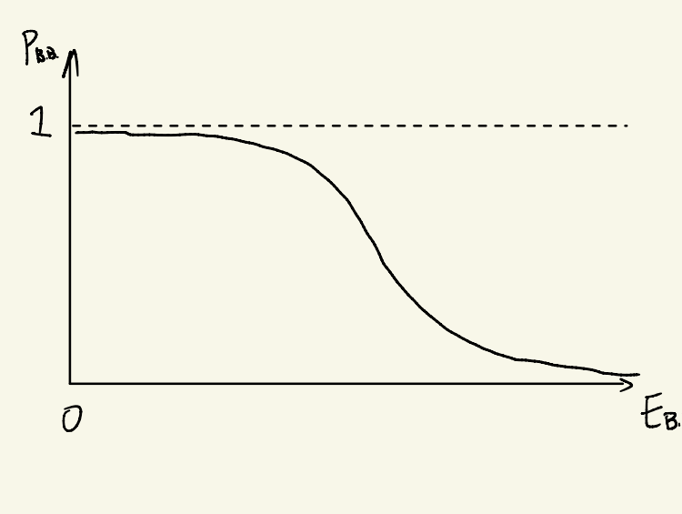
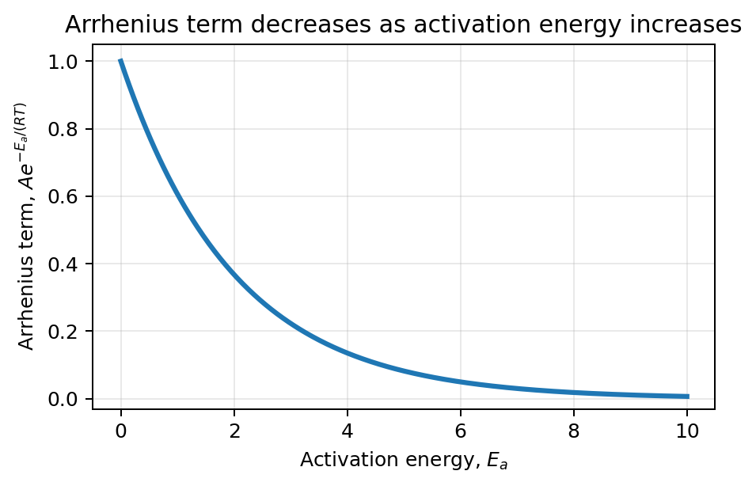
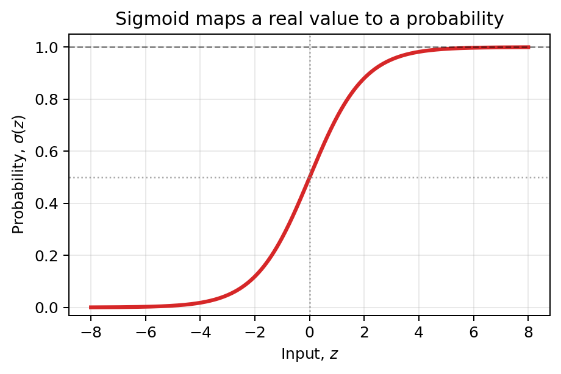
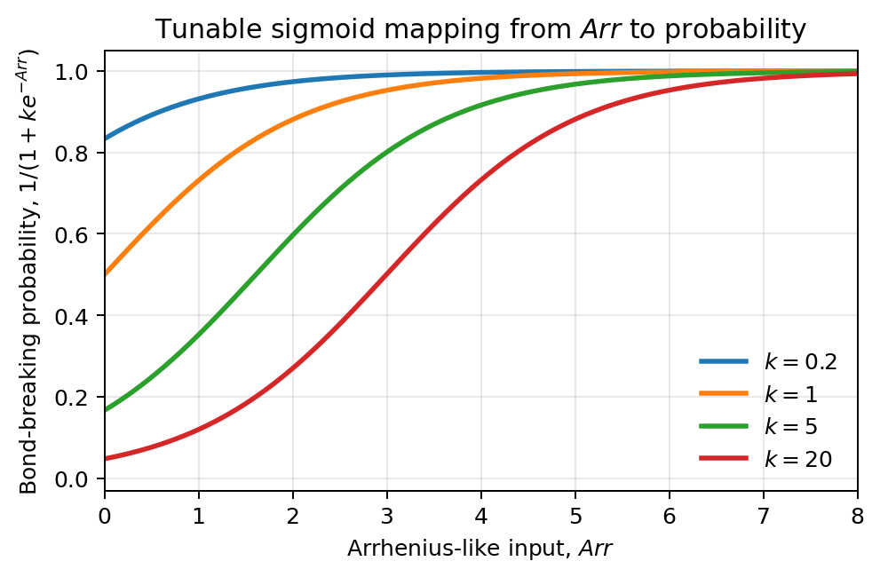

# Mapping Energy to Probability of Bond Breaking

We want to map **energy** to the **probability of bond breaking**.

For example, we observed hydrocarbon chains such as

```text
-C-C- ... -C-C-       C12H26
```

but we did not observe peroxide-like chains such as

```text
H-O-O- ... -O-H       H2ON
```

## Motivation

Why does this happen? It must have something to do with the **bond dissociation energy** (BDE).

The BDE of an O-O bond is approximately

```text
146 kJ/mol
```

The BDE of a C-C bond is approximately

```text
346 kJ/mol
```

Therefore, a C-C bond is about

```text
346 / 146 = 2.37
```

times stronger than an O-O bond.

From this perspective, we can think of a mapping algorithm that projects BDE to the probability of bond breaking:

```text
B.D.E -> P_bond breaking
```

## Assumptions

A few assumptions are made:

1. Neglect the difference between different C-C bonds, for example between an `H3C-CH2` bond and an `H2C-CH2` bond.

2. Do not consider H-C, H-N, and H-O bond breaking, because their strengths are stronger than C-C, O-O, etc.

3. Assume the molecule survival probability is the product of the probabilities that each bond does not break:

$P_{\mathrm{molecule\ survive}}= \prod_i \left(1 - P_{\mathrm{bond\ breaking}, i}\right)$

## What We Want

We want to map bond dissociation energy to bond-breaking probability:

$E_{\mathrm{BD}} \longrightarrow P_{\mathrm{BB}}$

The expected trend is:

- when `E_BB` is small, `P_BB` is close to 1;
- when `E_BB` is large, `P_BB` decreases toward 0.

In other words, weak bonds should have high bond-breaking probability, while strong bonds should have low bond-breaking probability.



This hand-drawn plot represents the desired mapping: as the bond-breaking energy increases, the probability of bond breaking decreases from near 1 toward 0.

## Candidate Tools

### Arrhenius Equation

The Arrhenius equation is

$\mathrm{Arr} = A e^{-E_a/(RT)}$

where:

- `A` is the pre-exponential factor;
- `E_a` is the activation energy;
- `R` is the gas constant;
- `T` is the temperature.

The Arrhenius term decreases as `E_a` increases.

**Modification for our purpose:** use the bond dissociation energy as the energy scale in an Arrhenius-like expression:

$\mathrm{Arr} = A e^{-E_D/(E_{\mathrm{ref}})}$



### Sigmoid Function

The sigmoid function is


$\sigma(z) = \frac{1}{1 + e^{-z}}$


It maps a real-valued input to a value between 0 and 1.



## Assemble the Desired Mapping

### 1. Introduce a Correction Term

Introduce a corrected Arrhenius-like term:


$\widetilde{\mathrm{Arr}}= \mathrm{Arr}(E_D) - \mathrm{Arr}_0$

where

$\mathrm{Arr}(E_D) = A e^{-E_D/E_{\mathrm{ref}}}$

The correction shifts the Arrhenius term by `Arr_0`.

### 2. Apply a Sigmoid Mapping

Map the corrected Arrhenius-like term to probability using a sigmoid-type function:

$\sigma(\widetilde{\mathrm{Arr}})=\frac{1}{1 + e^{-\left(Ae^{-E_D/E_{\mathrm{ref}}} - \mathrm{Arr}_0\right)}}$

This can be rewritten as

$\sigma(\widetilde{\mathrm{Arr}})=\frac{1}{1 + e^{-Ae^{-E_D/E_{\mathrm{ref}}}} e^{\mathrm{Arr}_0}}$

Equivalently, one may write a tunable version:

$\sigma(\mathrm{Arr}(E_D))=\frac{1}{1 + k e^{-Ae^{-E_D/E_{\mathrm{ref}}}}}$

or

$\sigma(\mathrm{Arr})=\frac{1}{1 + k e^{-\mathrm{Arr}}}$



where

$\mathrm{Arr} = A e^{-E_D/E_{\mathrm{ref}}}$

and the correction term is absorbed into the tunable parameter

$k = e^{\mathrm{Arr}_0}$.

The function `sigmoid` is interpreted as the probability of bond breaking.

For larger `k`, the sigmoid curve moves to the right. In this formulation, when $E_D$ becomes very large, $\mathrm{Arr}$ approaches 0, so the probability approaches

$\frac{1}{1+k}$.

Therefore, `k` should be chosen sufficiently large if the desired high-energy bond-breaking probability should be close to 0.


Therefore,

$P_{\mathrm{single\ bond\ breaking}}=\sigma(\mathrm{Arr}(E_D))$

and the molecule survival probability is

$P_{\mathrm{molecule\ survive}}=\prod_i\left(1 - P_{\mathrm{S.B.B.}, i}\right)$

where `P_S.B.B.` means the probability of single-bond breaking.
